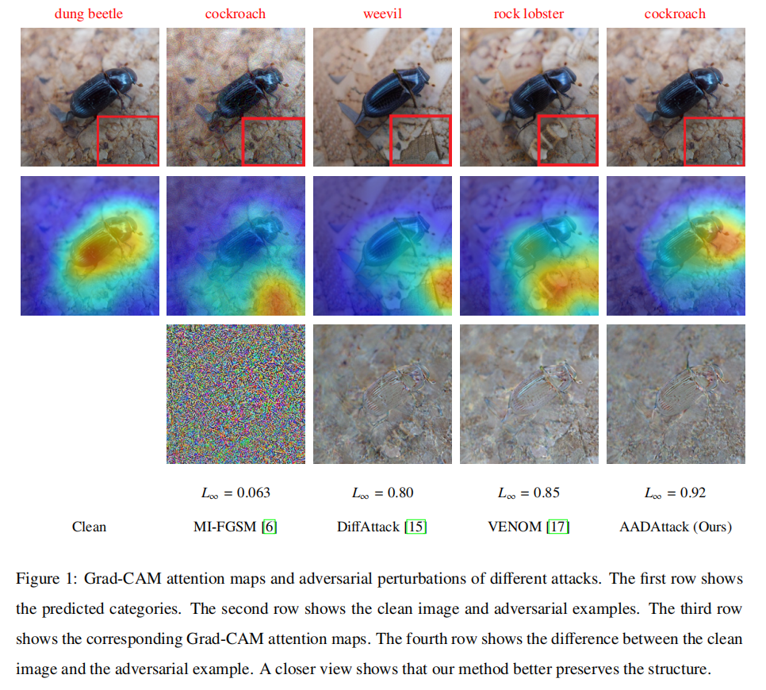
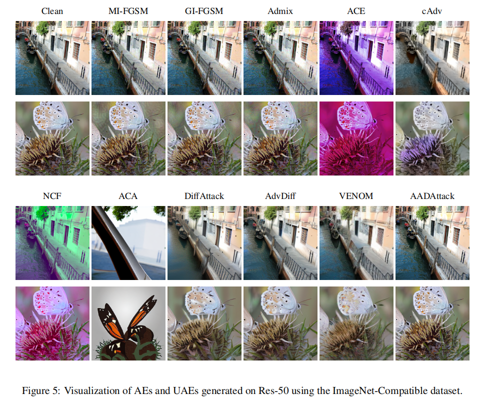

# Attention-Aligned Diffusion Attack for Transferable and Imperceptible Unrestricted Adversarial Examples (AADAttack)

The official code repository for our paper: **Attention-Aligned Diffusion Attack for Transferable and Imperceptible Unrestricted Adversarial Examples**.

## Overview

<div>
  
</div>


## Requirements

1. Hardware Requirements
    - GPU: 1x high-end NVIDIA GPU with at least 16GB memory
    - Memory: At least 40GB of storage memory

2. Software Requirements
    - Python >= 3.10
    - CUDA >= 12.2

   To install other necessary requirements:
   ```bash
   pip install diffusers transformers natsort
   ```
   *(Note: other dependencies like PyTorch, torchvision, tqdm, scipy, and timm are also required).*

3. Datasets
   Before running the attacks, please download the required datasets and place them in the root directory:
   - ImageNet-Compatible: Please download the dataset [ImageNet-Compatible](https://github.com/cleverhans-lab/cleverhans/tree/master/cleverhans_v3.1.0/examples/nips17_adversarial_competition/dataset). Place the images in `imagenet_compatible/images/` and the labels in `imagenet_compatible/labels.txt`.
   - UB_200_2011: Please download the dataset [CUB_200_2011](https://www.modelscope.cn/datasets/OpenDataLab/CUB-200-2011). Place the images in `cub_200_2011/images/` and the labels in `cub_200_2011/labels.txt`.
   - Stanford_Car: Please download the dataset [Stanford Cars](https://github.com/jhpohovey/StanfordCars-Dataset). Place the images in `standford_car/images/` and the labels in `standford_car/labels.txt`.

4. Models
   - **Stable Diffusion Model**: We adopt [Stable Diffusion 2.1 Base](https://huggingface.co/stabilityai/stable-diffusion-2-1-base) as our foundational diffusion model. You can specify its path via `--pretrained_diffusion_path` in your scripts.
     - **Note**: The official Hugging Face repository has been made private. You can download the weights from ModelScope instead: [stabilityai/stable-diffusion-2-1-base](https://www.modelscope.cn/models/stabilityai/stable-diffusion-2-1-base). Place the downloaded weights into `stabilityai/stable-diffusion-2-1-base/`.

   - **Commercial API Platforms**: For prompt generation via API, please register and obtain API Keys from the following platforms:
     - **Alibaba Bailian (DashScope)**: [bailian.aliyun.com](https://www.aliyun.com/product/bailian) (For Qwen3-VL, Kimi-k2.5)
     - **Google AI Studio**: [aistudio.google.com](https://aistudio.google.com) (For Gemma-3, Gemini3)
     - **OpenAI API Platform**: [platform.openai.com](https://platform.openai.com) (For GPT-5.4)

   - **Open-Source Multimodal Large Language Models (MLLMs)**: If API platforms are unavailable, you can consider downloading open-source weights from Hugging Face and placing them locally:
     - **Qwen3-VL-8B-Instruct**: [huggingface.co/Qwen/Qwen3-VL-8B-Instruct](https://huggingface.co/Qwen/Qwen3-VL-8B-Instruct) -> Place in `Qwen3-VL-8B-Instruct/`
     - **LLaVA v1.6 Mistral 7B**: [huggingface.co/llava-hf/llava-v1.6-mistral-7b-hf](https://huggingface.co/llava-hf/llava-v1.6-mistral-7b-hf) -> Place in `llava-v1.6-mistral-7b-hf/`
     - **Gemma-3-27b-it**: [huggingface.co/google/gemma-3-27b-it](https://huggingface.co/google/gemma-3-27b-it) -> Place in `gemma-3-27b-it/`
     - **InternVL2-8B**: [huggingface.co/OpenGVLab/InternVL2-8B](https://huggingface.co/OpenGVLab/InternVL2-8B) -> Place in `InternVL2-8B/`

## Prompt Generation

Our method leverages a Multimodal Large Language Model (MLLM) to generate a 15-token prompt triplet for each clean image: a context prompt, a foreground prompt, and a background prompt. The context prompt guides reverse diffusion, while the foreground and background prompts are used to construct complementary cross-attention and suppress cross-attention leakage.
The main manuscript uses Qwen-plus for the default prompt setting and additional MLLM/prompt-length sweeps in Table 3. The released `prompt_qwen.py` script provides a local 15-token Qwen3-VL-8B-Instruct reproduction path only; prompts from other MLLMs or longer prompt settings should be prepared externally in the same three-file format.

### Generating Prompt Triplets via Qwen3-VL
You can utilize the local `Qwen3-VL-8B-Instruct` model to automatically generate the prompt triplets required by AADAttack.
- Executing `python prompt_qwen.py` will iterate through your designated dataset.
- It generates one 15-token context prompt together with a class-label-constrained foreground prompt and a short non-target background prompt.
- The generated texts are saved into `Text/qwen3_vl/15_tokens.txt`, `Text/qwen3_vl/15_tokens_fg.txt`, and `Text/qwen3_vl/15_tokens_bg.txt`.

The foreground prompt is constrained to the canonical class label, while the context and background prompts are generated from the image content and used directly in the attack pipeline.

### Generating Prompt Triplets via APIs
Alternatively, you can also generate the same 15-token prompt triplets through commercial API platforms with your own API key.
- API-capable MLLMs such as Qwen3-VL / Kimi-k2.5, GPT-series models, and Gemma-series models can all be used, as long as they return the same three items: a short context prompt, the foreground class label, and one short background cue.
- Regardless of the provider, the final prompt files should still be saved as `Text/qwen3_vl/15_tokens.txt`, `Text/qwen3_vl/15_tokens_fg.txt`, and `Text/qwen3_vl/15_tokens_bg.txt`.
- The released codebase focuses on the local `Qwen3-VL-8B-Instruct` pipeline, while API-based prompt generation remains a supported alternative for users who prefer cloud inference.

## Crafting Unrestricted Adversarial Examples

The following command generates unrestricted adversarial examples utilizing our proposed AADAttack:
   
```bash
python main.py --model_name <surrogate_model> \
               --save_dir <save_path> \
               --images_root <clean_images_path> \
               --label_path <clean_images_label.txt> \
               --diffusion_steps 20 \
               --start_step 15 \
               --iterations 30 \
               --attack_loss_weight 10 \
               --transfer_loss_weight 1000 \
               --cross_attn_loss_weight 100 \
               --self_attn_loss_weight 100
```

AADAttack uses the 15-token context prompt to guide reverse diffusion, injects background semantics into the complementary salient regions of the foreground, and aligns complementary cross-attention together with middle self-attention to preserve visual imperceptibility. The specific surrogate models currently supported by `--model_name` include `resnet`, `mobile`, `vgg`, `vit`, `swin`, `deit-b`, `convnext`, `inception`, `deit-s`, `mixer-b`, and `mixer-l`.

## Evaluation
   
After generating the unrestricted adversarial examples, you can evaluate their transferability and imperceptibility using the provided scripts in the `tools/` directory.

### 1. Evaluating Transferability
To assess the adversarial transferability across different black-box models, run:
```bash
python tools/eval_asr.py
```


### 2. Evaluating Imperceptibility
To ensure the imperceptibility of the generated semantic perturbations compared to the clean references, compute the Learned Perceptual Image Patch Similarity (LPIPS):
```bash
python tools/eval_lpips.py
```

## Results

<div align="center">
  
  <br>
  <br>
  
  <br>
  <br>
  
  <br>
  <br>
  
  <br>
  <br>
  
  <br>
  <br>
  
</div>

## Acknowledgement

We would like to thank the authors of LDM, and DiffAttack for their great work and generously providing source codes, which inspired our work and helped us a lot in the implementation. Source codes are available at: [latent-diffusion](https://github.com/CompVis/latent-diffusion) and [DiffAttack](https://github.com/WindVChen/DiffAttack).

## License

This project is licensed under the Apache-2.0 license. See [LICENSE](LICENSE) for details.
