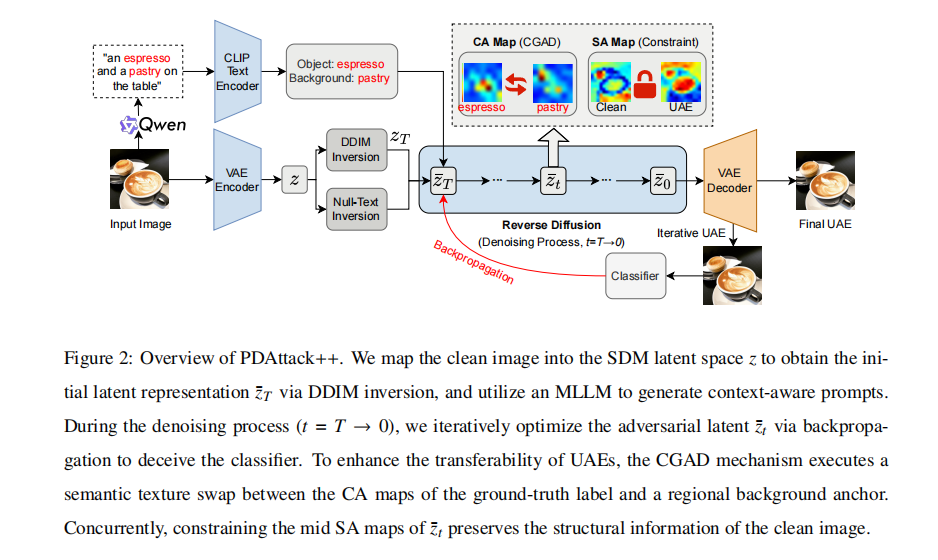
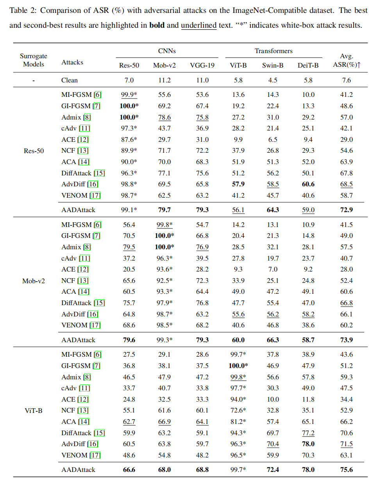
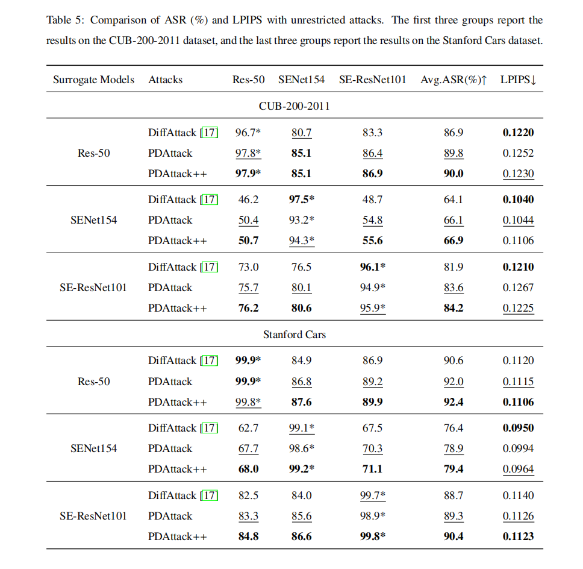
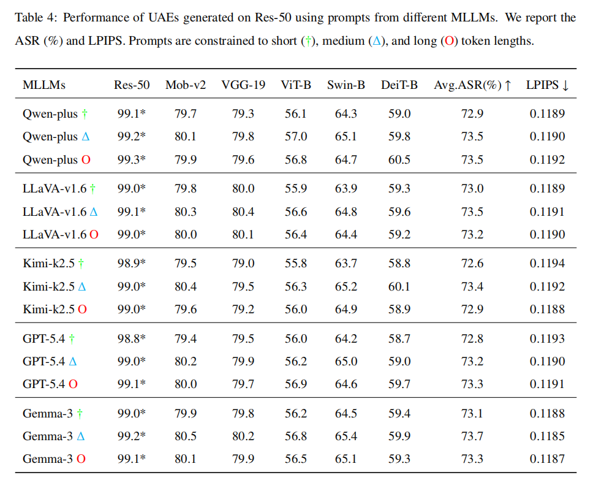
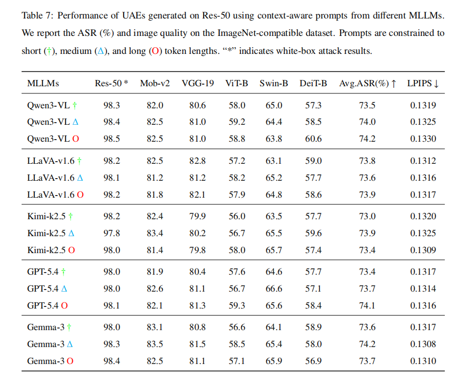

# Rethinking Transferable Unrestricted Attacks via Prompt-Driven Diffusion (PDAttack++)
 
The official code repository for our paper: **Rethinking Transferable Unrestricted Attacks via Prompt-Driven Diffusion**.

## Overview

<div>
  
</div>


## Requirements

1. Hardware Requirements
    - GPU: 1x high-end NVIDIA GPU with at least 16GB memory
    - Memory: At least 40GB of storage memory

2. Software Requirements
    - Python >= 3.10
    - CUDA >= 12.2

   To install other necessary requirements:
   ```bash
   pip install diffusers transformers natsort
   ```
   *(Note: other dependencies like PyTorch, torchvision, tqdm, scipy, and timm are also required).*

3. Datasets
   Before running the attacks, please download the required datasets and place them in the root directory:
   - ImageNet-Compatible: Please download the dataset [ImageNet-Compatible](https://github.com/cleverhans-lab/cleverhans/tree/master/cleverhans_v3.1.0/examples/nips17_adversarial_competition/dataset). Place the images in `imagenet_compatible/images/` and the labels in `imagenet_compatible/labels.txt`.
   - UB_200_2011: Please download the dataset [CUB_200_2011](https://www.modelscope.cn/datasets/OpenDataLab/CUB-200-2011). Place the images in `cub_200_2011/images/` and the labels in `cub_200_2011/labels.txt`.
   - Stanford_Car: Please download the dataset [Stanford Cars](https://github.com/jhpohovey/StanfordCars-Dataset). Place the images in `standford_car/images/` and the labels in `standford_car/labels.txt`.

4. Models
   - **Stable Diffusion Model**: We adopt [Stable Diffusion 2.1 Base](https://huggingface.co/stabilityai/stable-diffusion-2-1-base) as our foundational diffusion model. You can specify its path via `--pretrained_diffusion_path` in your scripts.
     - **Note**: The official Hugging Face repository has been made private. You can download the weights from ModelScope instead: [stabilityai/stable-diffusion-2-1-base](https://www.modelscope.cn/models/stabilityai/stable-diffusion-2-1-base). Place the downloaded weights into `stabilityai/stable-diffusion-2-1-base/`.

   - **Commercial API Platforms**: For prompt generation via API, please register and obtain API Keys from the following platforms:
     - **Alibaba Bailian (DashScope)**: [bailian.aliyun.com](https://www.aliyun.com/product/bailian) (For Qwen3-VL, Kimi-k2.5)
     - **Google AI Studio**: [aistudio.google.com](https://aistudio.google.com) (For Gemma-3, Gemini3)
     - **OpenAI API Platform**: [platform.openai.com](https://platform.openai.com) (For GPT-5.4)

   - **Open-Source Multimodal Large Language Models (MLLMs)**: If API platforms are unavailable, you can consider downloading open-source weights from Hugging Face and placing them locally:
     - **Qwen3-VL-8B-Instruct**: [huggingface.co/Qwen/Qwen3-VL-8B-Instruct](https://huggingface.co/Qwen/Qwen3-VL-8B-Instruct) -> Place in `Qwen3-VL-8B-Instruct/`
     - **LLaVA v1.6 Mistral 7B**: [huggingface.co/llava-hf/llava-v1.6-mistral-7b-hf](https://huggingface.co/llava-hf/llava-v1.6-mistral-7b-hf) -> Place in `llava-v1.6-mistral-7b-hf/`
     - **Gemma-3-27b-it**: [huggingface.co/google/gemma-3-27b-it](https://huggingface.co/google/gemma-3-27b-it) -> Place in `gemma-3-27b-it/`
     - **InternVL2-8B**: [huggingface.co/OpenGVLab/InternVL2-8B](https://huggingface.co/OpenGVLab/InternVL2-8B) -> Place in `InternVL2-8B/`

## Prompt Generation

Our method leverages Multimodal Large Language Models (MLLMs) to generate targeted text prompts that guide the diffusion model during the adversarial attack process. By dynamically perceiving the clean image, the MLLM produces dense text descriptions.

### Generating Prompts via Open-Source MLLMs
You can strictly utilize local models such as `Qwen3-VL-8B-Instruct` to automatically generate descriptive prompts. 
- Executing `python prompt_qwen.py` will iterate through your designated dataset.
- It prompts the MLLM to generate 15, 45, or 75-token descriptions focusing precisely on the target object class to build high-quality context conditions.
- The generated texts are saved as `.txt` sequences in the `Text/qwen3_vl/` folder.

### Generating Prompts via Commercial APIs
Alternatively, for higher quality or zero-local-overhead generation, you can utilize cloud API platforms:
- You must parse your respective API keys for Alibaba Bailian (Qwen3-VL / Kimi-k2.5), Google AI Studio (Gemma-3 / Gemini3), or OpenAI (GPT-5.4).
- Sending the clean image alongside an instructional prompt will retrieve concise semantic descriptions similar to the local deployment pipeline.

## Crafting Unrestricted Adversarial Examples

The following command generates unrestricted adversarial examples utilizing our proposed PDAttack++:
   
```bash
python main.py --model_name <surrogate_model> \
               --save_dir <save_path> \
               --images_root <clean_images_path> \
               --label_path <clean_images_label.txt> \
               --diffusion_steps 20 \
               --start_step 15 \
               --iterations 30 \
               --attack_loss_weight 10 \
               --cross_attn_loss_weight 10000 \
               --self_attn_loss_weight 100
```
   
The specific surrogate models we support can be found in `tools/eval_asr.py` (e.g., `resnet50`, `vgg19`, `vit_base_patch16_224`, etc.).

## Probing Analysis Baselines

To investigate how cross-attention layers and prompts of diffusion models contribute to the transferability of unrestricted adversarial examples, we provide 4 distinct probing baselines inside the `probing_analysis/` directory. Each baseline demonstrates a separate ablation as discussed in the paper.

### 1. Probing Prompt Replacement
We explore whether guiding unrestricted adversarial example generation with correct or similarly categorized prompts can effectively disrupt the attention maps:
- **Correct Prompt** (`main_correct.py`): Reconstructs the image exclusively guided by the exact true label.
- **Similar Prompt** (`main_similar.py`): Replaces the ground-truth label with a conceptually similar category.

### 2. Probing Prompt Perturbations
We accumulate and average the cross-attention maps to distribute attention uniformly across every pixel and disrupt original semantic associations:
- **Target Label Perturbation** (`main_single.py`): Only perturbs the attention of the target object.
- **Full Context Perturbation** (`main_context.py`): Perturbs the attention of the entire context message.

*You can execute any of these baselines identically to the core workflow by simply running the respective `probing_analysis/main_*.py` script.*

## Evaluation
   
After generating the unrestricted adversarial examples, you can evaluate their transferability and imperceptibility using the provided scripts in the `tools/` directory.

### 1. Evaluating Transferability
To assess the adversarial transferability across different black-box models, run:
```bash
python tools/eval_asr.py
```


### 2. Evaluating Imperceptibility
To ensure the imperceptibility of the generated semantic perturbations compared to the clean references, compute the Learned Perceptual Image Patch Similarity (LPIPS):
```bash
python tools/eval_lpips.py
```

## Results

<div align="center">
  
  <br>
  <br>
  
  <br>
  <br>
  
    <br>
  <br>
  
</div>

## Acknowledgement

We would like to thank the authors of LDM, and DiffAttack for their great work and generously providing source codes, which inspired our work and helped us a lot in the implementation. Source codes are available at: [latent-diffusion](https://github.com/CompVis/latent-diffusion) and [DiffAttack](https://github.com/WindVChen/DiffAttack).

## License

This project is licensed under the Apache-2.0 license. See [LICENSE](LICENSE) for details.